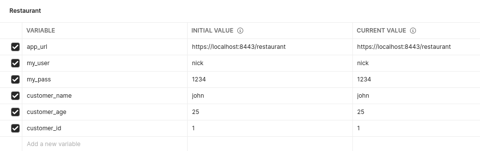

# T10 - SOEN 487

This is the template provided to start the web server for Tutorial 10.
You should download this to follow along when watching the tutorial.

The finished example can be found on the finished branch of this repository.

We encourage you to use either IntelliJ IDE **or** maven from command line in order to get the best support from our TAs.

## Included Projects ##

1. The server/REST API
   * Located in /server
   * Is used to hold the REST API built in tutorial 3

2. The example and github client which we will not be using for this tutorial

3. User, UserRest and MyResponse classes which we will use for the token authentication.

## IntelliJ Instructions ##

* For each included project, navigate to the directory and find the pom.xml file, right

click and click on "Add as Maven Project" to load up the project and start working on it.

* Browse to desired class to run the main method
* Right click associated class and choose Run main()

## Postman Instructions ##

To use the postman collection, please import the Tutorial10.postman_collection.json file into postman.
This will help you set up all the API endpoints included in this tutorial.

You will also need to set up a new environment, with the following variables included,
so that you will be able to store some general variable for the requests.

## Maven Instructions ##

    Run the following commands in the associated project directory:

    Compile:
        mvn install

    Run (Server)
        mvn exec:java -Pserver

    Clean:
        mvn clean

## Curl Instructions ##

    To send a curl request with the https implemented, you will need to use the .crt file that was generated.

    Example:
        curl --cacert localhost.crt https://localhost:8080/restaurant/customerform

To use API with chrome you will have to import the .p12 file in chrome. The tutorial contains info on how to do that.
